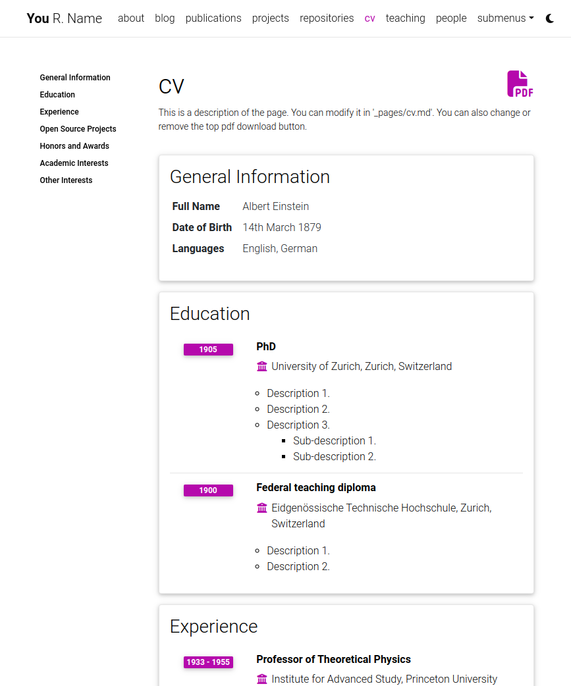
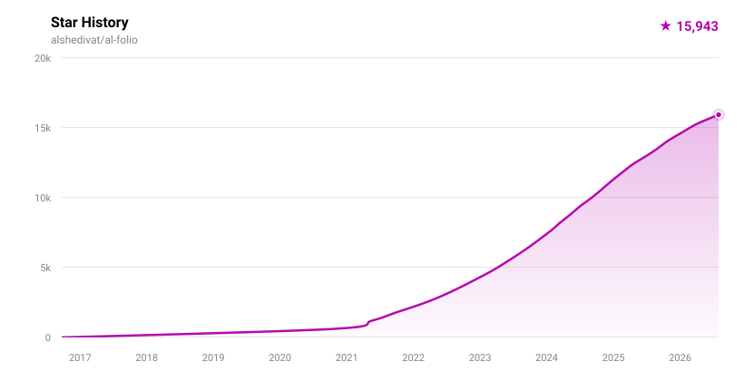

# al-folio

<div align="center">

[](https://alshedivat.github.io/al-folio/)

**A simple, clean, and responsive [Jekyll](https://jekyllrb.com/) starter for academic websites.**

_In `v1.x`, al-folio is a **thin starter, not a theme**: the runtime ships as independently versioned plugin gems, so you pick up fixes and features by bumping a pinned version in your `Gemfile` instead of merging theme internals into your site._

---

[](https://github.com/alshedivat/al-folio/actions/workflows/deploy.yml)
[](https://alshedivat.github.io/al-folio/)
[](https://github.com/alshedivat/al-folio/graphs/contributors/)
[![Maintainers][maintainers]](#maintainers)
[](https://github.com/alshedivat/al-folio/releases/latest)
[](https://github.com/alshedivat/al-folio/blob/master/LICENSE)
[](https://github.com/alshedivat/al-folio)
[](https://github.com/alshedivat/al-folio/fork)

[](https://hub.docker.com/r/amirpourmand/al-folio)
[](https://hub.docker.com/r/amirpourmand/al-folio)
[](https://hub.docker.com/r/amirpourmand/al-folio)

A simple, clean, and responsive [Jekyll](https://jekyllrb.com/) theme for academics.
If you like the theme, give it a star!

[](https://alshedivat.github.io/al-folio/)


## Getting started

**⚠️ Important: Use "Use this template" (not fork)**

When creating your own website with al-folio, you have two options:

- ✅ **Recommended:** Click "[Use this template](https://github.com/new?template_name=al-folio&template_owner=alshedivat)" – This creates a clean copy that is independent from the main al-folio repository. Changes you make to your site won't be accidentally submitted to al-folio as pull requests.
- ❌ **Not recommended:** Forking the repository – This keeps a link to the main al-folio repo, making it easy to accidentally submit your personal site changes as contributions to our project.

**If you already forked:** Don't worry! You can still work with your fork normally. Just make sure to:

1. Make changes on a dedicated branch (e.g., `my-site-updates`)
2. When pushing changes, always verify you're pushing to **your own repository**, not the main al-folio repository
3. Never create pull requests to `alshedivat/al-folio` unless you're intentionally contributing improvements that benefit all users

For quick setup, see [docs/QUICKSTART.md](docs/QUICKSTART.md).

Want to learn more about Jekyll? Check out [this tutorial](https://www.taniarascia.com/make-a-static-website-with-jekyll/). Why Jekyll? Read [Andrej Karpathy's blog post](https://karpathy.github.io/2014/07/01/switching-to-jekyll/)! Why write a blog? Read [Rachel Thomas blog post](https://medium.com/@racheltho/why-you-yes-you-should-blog-7d2544ac1045).

## Table Of Contents

<!--ts-->

- [al-folio](#al-folio)
  - [Getting started](#getting-started)
  - [Table Of Contents](#table-of-contents)
  - [Installing and Deploying](#installing-and-deploying)
  - [Customizing](#customizing)
  - [Plugin Ecosystem](#plugin-ecosystem)
  - [Using AI Agents](#using-ai-agents)
    - [Codex](#codex)
    - [Claude](#claude)
    - [Copilot And Other Agents](#copilot-and-other-agents)
  - [Documentation](#documentation)
  - [Features](#features)
    - [Light/Dark Mode](#lightdark-mode)
    - [CV](#cv)
    - [People](#people)
    - [Publications](#publications)
    - [Collections](#collections)
    - [Layouts](#layouts)
      - [The iconic style of Distill](#the-iconic-style-of-distill)
      - [Full support for math &amp; code](#full-support-for-math--code)
      - [Photos, Audio, Video and more](#photos-audio-video-and-more)
    - [Other features](#other-features)
      - [GitHub's repositories and user stats](#githubs-repositories-and-user-stats)
      - [Theming](#theming)
      - [Social media previews](#social-media-previews)
      - [Atom (RSS-like) Feed](#atom-rss-like-feed)
      - [Related posts](#related-posts)
      - [Code quality checks](#code-quality-checks)
      - [GDPR Cookie Consent Dialog](#gdpr-cookie-consent-dialog)
  - [User community](#user-community)
  - [Lighthouse PageSpeed Insights](#lighthouse-pagespeed-insights)
    - [Desktop](#desktop)
    - [Mobile](#mobile)
  - [FAQ](#faq)
  - [Contributing](#contributing)
    - [Maintainers](#maintainers)
    - [All Contributors](#all-contributors)
  - [Star History](#star-history)
  - [License](#license)

<!--te-->

## Installing and Deploying

For installation and deployment details please refer to [docs/INSTALL.md](docs/INSTALL.md).

For a hands-on walkthrough of al-folio installation, check out [this cool video tutorial](https://www.youtube.com/watch?v=g6AJ9qPPoyc) by one of the community members! 🎬 🍿

---

#### Local setup using Docker (Recommended on Windows)

You need to take the following steps to get `al-folio` up and running in your local machine:

- First, install [docker](https://docs.docker.com/get-docker/) and [docker-compose](https://docs.docker.com/compose/install/).
- Then, clone this repository to your machine:

```bash
$ git clone git@github.com:<your-username>/<your-repo-name>.git
$ cd <your-repo-name>
```

Finally, run the following command that will pull a pre-built image from DockerHub and will run your website.

```bash
$ docker-compose up
```

Note that when you run it for the first time, it will download a docker image of size 300MB or so.

Now, feel free to customize the theme however you like (don't forget to change the name!). After you are done, you can use the same command (`docker-compose up`) to render the webpage with all you changes. Also, make sure to commit your final changes.

> To change port number, you can edit `docker-compose.yml` file.

<details><summary>(click to expand) <strong>Build your own docker image:</strong></summary>

> Note: this approach is only necessary if you would like to build an older or very custom version of al-folio.

Build and run a new docker image using:
```bash
$ docker-compose -f docker-local.yml up
```
> If you want to update jekyll, install new ruby packages, etc., all you have to do is build the image again using `--force-recreate` argument at the end of previous command! It will download ruby and jekyll and install all ruby packages again from scratch.

</details>

---

#### Local Setup (Standard)

Assuming you have [Ruby](https://www.ruby-lang.org/en/downloads/) and [Bundler](https://bundler.io/) installed on your system (*hint: for ease of managing ruby gems, consider using [rbenv](https://github.com/rbenv/rbenv)*), first click [Use this template](https://docs.github.com/repositories/creating-and-managing-repositories/creating-a-repository-from-a-template) above the file list, create a new repository at `github.com:<your-username>/<your-repo-name>` from `github.com:alshedivat/al-folio` and do the following:

```bash
$ git clone git@github.com:<your-username>/<your-repo-name>.git
$ cd <your-repo-name>
$ bundle install
$ bundle exec jekyll serve --lsi
```

Now, feel free to customize the theme however you like (don't forget to change the name!).
After you are done, **commit** your final changes.

---

#### Deployment

Deploying your website to [GitHub Pages](https://pages.github.com/) is the most popular option.
Starting version [v0.3.5](https://github.com/alshedivat/al-folio/releases/tag/v0.3.5), **al-folio** will automatically re-deploy your webpage each time you push new changes to your repository! :sparkles:

**For personal and organization webpages:**
1. Rename your repository to `<your-github-username>.github.io` or `<your-github-orgname>.github.io`.
2. In `_config.yml`, set `url` to `https://<your-github-username>.github.io` and leave `baseurl` empty.
3. Set up automatic deployment of your webpage (see instructions below).
4. Make changes, commit, and push!
5. After deployment, the webpage will become available at `<your-github-username>.github.io`.

**For project pages:**
1. In `_config.yml`, set `url` to `https://<your-github-username>.github.io` and `baseurl` to `/<your-repository-name>/`.
2. Set up automatic deployment of your webpage (see instructions below).
3. Make changes, commit, and push!
4. After deployment, the webpage will become available at `<your-github-username>.github.io/<your-repository-name>/`.

**To enable automatic deployment:**
1. Click on **Actions** tab and **Enable GitHub Actions**; do not worry about creating any workflows as everything has already been set for you.
2. Go to Settings -> Actions -> General -> Workflow permissions, and give **Read and write permissions** to GitHub Actions
3. Make any other changes to your webpage, commit, and push. This will automatically trigger the **Deploy** action.
4. Wait for a few minutes and let the action complete. You can see the progress in the **Actions** tab. If completed successfully, in addition to the `master` branch, your repository should now have a newly built `gh-pages` branch.
5. Finally, in the **Settings** of your repository, in the Pages section, set the branch to `gh-pages` (**NOT** to `master`). For more details, see [Configuring a publishing source for your GitHub Pages site](https://docs.github.com/en/pages/getting-started-with-github-pages/configuring-a-publishing-source-for-your-github-pages-site#choosing-a-publishing-source).


<details><summary>(click to expand) <strong>Manual deployment to GitHub Pages:</strong></summary>

If you need to manually re-deploy your website to GitHub pages, run the deploy script from the root directory of your repository:
```bash
$ ./bin/deploy
```
uses the `master` branch for the source code and deploys the webpage to `gh-pages`.

</details>

<details><summary>(click to expand) <strong>Deployment to another hosting server (non GitHub Pages):</strong></summary>

If you decide to not use GitHub Pages and host your page elsewhere, simply run:
```bash
$ bundle exec jekyll build --lsi
```
which will (re-)generate the static webpage in the `_site/` folder.
Then simply copy the contents of the `_site/` foder to your hosting server.

**Note:** Make sure to correctly set the `url` and `baseurl` fields in `_config.yml` before building the webpage. If you are deploying your webpage to `your-domain.com/your-project/`, you must set `url: your-domain.com` and `baseurl: /your-project/`. If you are deploing directly to `your-domain.com`, leave `baseurl` blank.

</details>

<details><summary>(click to expand) <strong>Deployment to a separate repository (advanced users only):</strong></summary>

**Note:** Do not try using this method unless you know what you are doing (make sure you are familiar with [publishing sources](https://help.github.com/en/github/working-with-github-pages/about-github-pages#publishing-sources-for-github-pages-sites)). This approach allows to have the website's source code in one repository and the deployment version in a different repository.

Let's assume that your website's publishing source is a `publishing-source` sub-directory of a git-versioned repository cloned under `$HOME/repo/`.
For a user site this could well be something like `$HOME/<user>.github.io`.

Firstly, from the deployment repo dir, checkout the git branch hosting your publishing source.

Then from the website sources dir (commonly your al-folio fork's clone):
```bash
$ bundle exec jekyll build --lsi --destination $HOME/repo/publishing-source
```

This will instruct jekyll to deploy the website under `$HOME/repo/publishing-source`.

**Note:** Jekyll will clean `$HOME/repo/publishing-source` before building!

The quote below is taken directly from the [jekyll configuration docs](https://jekyllrb.com/docs/configuration/options/):

> Destination folders are cleaned on site builds
>
> The contents of `<destination>` are automatically cleaned, by default, when the site is built. Files or folders that are not created by your site will be removed. Some files could be retained by specifying them within the `<keep_files>` configuration directive.
>
> Do not use an important location for `<destination>`; instead, use it as a staging area and copy files from there to your web server.

If `$HOME/repo/publishing-source` contains files that you want jekyll to leave untouched, specify them under `keep_files` in `_config.yml`.
In its default configuration, al-folio will copy the top-level `README.md` to the publishing source. If you want to change this behaviour, add `README.md` under `exclude` in `_config.yml`.

**Note:** Do _not_ run `jekyll clean` on your publishing source repo as this will result in the entire directory getting deleted, irrespective of the content of `keep_files` in `_config.yml`.

</details>

---

#### Upgrading from a previous version

If you installed **al-folio** as described above, you can upgrade to the latest version as follows:

```bash
# Assuming the current directory is <your-repo-name>
$ git remote add upstream https://github.com/alshedivat/al-folio.git
$ git fetch upstream
$ git rebase v0.3.5
```

If you have extensively customized a previous version, it might be trickier to upgrade.
You can still follow the steps above, but `git rebase` may result in merge conflicts that must be resolved.
See [git rebase manual](https://help.github.com/en/github/using-git/about-git-rebase) and how to [resolve conflicts](https://help.github.com/en/github/using-git/resolving-merge-conflicts-after-a-git-rebase) for more information.
If rebasing is too complicated, we recommend to re-install the new version of the theme from scratch and port over your content and changes from the previous version manually.

---

### FAQ

Here are some frequently asked questions.
If you have a different question, please ask using [Discussions](https://github.com/alshedivat/al-folio/discussions/categories/q-a).

1. **Q:** After I create a new repository from this template and setup the repo, I get a deployment error.
   Isn't the website supposed to correctly deploy automatically? <br>
   **A:** Yes, if you are using release `v0.3.5` or later, the website will automatically and correctly re-deploy right after your first commit.
   Please make some changes (e.g., change your website info in `_config.yml`), commit, and push.
   Make sure to follow [deployment instructions](https://github.com/alshedivat/al-folio#deployment) in the previous section.
   (Relevant issue: [209](https://github.com/alshedivat/al-folio/issues/209#issuecomment-798849211).)

2. **Q:** I am using a custom domain (e.g., `foo.com`).
   My custom domain becomes blank in the repository settings after each deployment.
   How do I fix that? <br>
   **A:** You need to add `CNAME` file to the `master` or `source` branch of your repository.
   The file should contain your custom domain name.
   (Relevant issue: [130](https://github.com/alshedivat/al-folio/issues/130).)

3. **Q:** My webpage works locally.
    But after deploying, it is not displayed correctly (CSS and JS is not loaded properly).
    How do I fix that? <br>
   **A:** Make sure to correctly specify the `url` and `baseurl` paths in `_config.yml`.
   Set `url` to `https://<your-github-username>.github.io` or to `https://<your.custom.domain>` if you are using a custom domain.
   If you are deploying a personal or organization website, leave `baseurl` blank.
   If you are deploying a project page, set `baseurl: /<your-project-name>/`.

4. **Q:** Atom feed doesn't work. Why?
   <br>
   **A:** Make sure to correctly specify the `url` and `baseurl` paths in `_config.yml`.
  RSS Feed plugin works with these correctly set up fields: `title`, `url`, `description` and `author`.
  Make sure to fill them in an appropriate way and try again.

For customization details please refer to [docs/CUSTOMIZE.md](docs/CUSTOMIZE.md).

## Plugin Ecosystem

`al-folio` is a thin starter in `v1.x`. Runtime features are plugin-owned and published as Ruby gems.

- Ownership boundaries: [docs/BOUNDARIES.md](docs/BOUNDARIES.md)
- Plugin catalog metadata: [`_data/featured_plugins.yml`](_data/featured_plugins.yml)
- Rendered plugin catalog: [alshedivat.github.io/al-folio/plugins/](https://alshedivat.github.io/al-folio/plugins/)
- Plugin catalog page source: [`_pages/plugins.md`](_pages/plugins.md)

The catalog page is deliberately kept out of the navbar (`nav: false`) so the demo site's chrome stays unchanged; reach it through the links above.

Naming convention:

- Theme-coupled plugins use `al-folio-<feature>` repos and `al_folio_<feature>` gem/plugin ids.
- Reusable plugins can use `al-<feature>` or neutral naming.

Featured plugins and bundled starter plugins are different tracks. Bundling requires explicit updates to [Gemfile](Gemfile) and [\_config.yml](_config.yml).
Plugin-owned changes should be made in the owning `al-org-dev` plugin repository, not by copying runtime assets into this starter.
The bundled v1 plugin repos are:

- [`al-folio-core`](https://github.com/al-org-dev/al-folio-core): shared layouts, includes, style/runtime primitives, and upgrade contracts
- [`al-folio-cv`](https://github.com/al-org-dev/al-folio-cv): CV rendering
- [`al-folio-distill`](https://github.com/al-org-dev/al-folio-distill): Distill layouts and runtime assets
- [`al-folio-bootstrap-compat`](https://github.com/al-org-dev/al-folio-bootstrap-compat): temporary Bootstrap compatibility runtime
- [`al-folio-upgrade`](https://github.com/al-org-dev/al-folio-upgrade): v1 upgrade audit/report/codemods
- [`al-icons`](https://github.com/al-org-dev/al-icons): icon loading
- [`al-search`](https://github.com/al-org-dev/al-search): search runtime
- [`al-citations`](https://github.com/al-org-dev/al-citations): publication/citation helpers
- [`al-ext-posts`](https://github.com/al-org-dev/al-ext-posts): external post ingestion
- [`al-analytics`](https://github.com/al-org-dev/al-analytics), [`al-comments`](https://github.com/al-org-dev/al-comments), [`al-cookie`](https://github.com/al-org-dev/al-cookie), [`al-img-tools`](https://github.com/al-org-dev/al-img-tools), [`al-math`](https://github.com/al-org-dev/al-math), [`al-charts`](https://github.com/al-org-dev/al-charts), and [`al-newsletter`](https://github.com/al-org-dev/al-newsletter): feature-specific runtime and integration behavior

## Using AI Agents

`al-folio` v1.x is designed for agent-assisted setup and migration. Agents should read [AGENTS.md](AGENTS.md) first, then use [docs/BOUNDARIES.md](docs/BOUNDARIES.md) to route changes to the starter or the owning plugin repo.

For existing customized forks, the recommended migration path is to ask an agent to use the [al-folio v1 migration skill](.agents/skills/al-folio-v1-migration/SKILL.md). The skill walks through creating a disposable migration branch, bringing site-owned content/config/data onto the v1 starter contract, running `al_folio_upgrade`, auditing local overrides, and validating the build. This is preferred over a manual file-by-file upgrade because v1 runtime ownership moved into plugins and local overrides need explicit drift tracking.

The canonical skills live in [.agents/skills/](.agents/skills/). They are also exposed through `.codex/skills/` and `.claude/skills/` symlinks for agents that discover skills from tool-specific directories.

### Codex

Codex can use the repo-local skills:

- [al-folio bootstrap](.agents/skills/al-folio-bootstrap/SKILL.md): create and configure a new v1 site.
- [al-folio v1 migration](.agents/skills/al-folio-v1-migration/SKILL.md): migrate customized forks and audit local overrides.

Useful first prompts:

- "Use the al-folio bootstrap skill to configure my new site."
- "Use the al-folio v1 migration skill to migrate this customized fork and run the override audit."

### Claude

Claude should start from [CLAUDE.md](CLAUDE.md), which imports [AGENTS.md](AGENTS.md). For setup or migration tasks, use the matching skill from `.claude/skills/`, which points to the canonical `.agents/skills/` directory.

### Copilot And Other Agents

Copilot should follow [.github/copilot-instructions.md](.github/copilot-instructions.md) and the specialized agents in [.github/agents/](.github/agents/). Other agents should follow the same rule: keep starter work in this repo, route runtime behavior to the owning `al-org-dev` plugin, and run `bundle exec al-folio upgrade overrides audit` whenever local overrides are added or retained.

## Documentation

Comprehensive guides for all aspects of your al-folio website:

- **[Documentation index](docs/README.md)** – All user, maintainer, and migration guides
- **[Quick Start](docs/QUICKSTART.md)** – Get running in 5 minutes
- **[Installation & Deployment](docs/INSTALL.md)** – Set up your site on GitHub Pages or other platforms
- **[Customization Guide](docs/CUSTOMIZE.md)** – Personalize your website (CVs, publications, themes, etc.)
- **[Troubleshooting](docs/TROUBLESHOOTING.md)** – Fix common issues (deployment, build, styling, content)
- **[FAQ](docs/FAQ.md)** – Frequently asked questions and solutions
- **[Analytics](docs/ANALYTICS.md)** – Add website analytics and visitor tracking
- **[SEO Guide](docs/SEO.md)** – Optimize for search engines and improve discoverability
- **[Plugin Catalog](https://alshedivat.github.io/al-folio/plugins/)** – Featured and bundled plugin metadata ([page source](_pages/plugins.md))

## Features

### Light/Dark Mode

This template has a built-in light/dark mode. It detects the user preferred color scheme and automatically switches to it. You can also manually switch between light and dark mode by clicking on the sun/moon icon in the top right corner of the page.

<p align="center">


</p>

---

### CV

Your CV can be generated in one of two modern formats: **RenderCV** (recommended, with automatic PDF generation) or **JSONResume** (standardized JSON format). You can use both simultaneously and switch between them, or maintain just the one you prefer.

[](https://alshedivat.github.io/al-folio/cv/)

For setup and customization details, see [Modifying the CV information](docs/CUSTOMIZE.md#modifying-the-cv-information) in [docs/CUSTOMIZE.md](docs/CUSTOMIZE.md).

---

### People

You can create a people page if you want to feature more than one person. Each person can have its own short bio, profile picture, and you can also set if every person will appear at the same or opposite sides.

[](https://alshedivat.github.io/al-folio/people/)

---

### Publications

Your publications page is generated automatically from your BibTeX bibliography. You can customize publication display, add extra information like PDFs, and control sorting behavior.

<details><summary>(click to expand) <strong>Author annotation:</strong></summary>

In publications, the author entry for yourself is identified by string array `scholar:last_name` and string array `scholar:first_name` in `_config.yml`:
```
scholar:
  last_name: [Einstein]
  first_name: [Albert, A.]
```
If the entry matches one form of the last names and the first names, it will be underlined.
Keep meta-information about your co-authors in `_data/coauthors.yml` and Jekyll will insert links to their webpages automatically.
The coauthor data format in `_data/coauthors.yml` is as follows,
```
"Adams":
  - firstname: ["Edwin", "E.", "E. P.", "Edwin Plimpton"]
    url: https://en.wikipedia.org/wiki/Edwin_Plimpton_Adams

"Podolsky":
  - firstname: ["Boris", "B.", "B. Y.", "Boris Yakovlevich"]
    url: https://en.wikipedia.org/wiki/Boris_Podolsky

"Rosen":
  - firstname: ["Nathan", "N."]
    url: https://en.wikipedia.org/wiki/Nathan_Rosen

"Bach":
  - firstname: ["Johann Sebastian", "J. S."]
    url: https://en.wikipedia.org/wiki/Johann_Sebastian_Bach

  - firstname: ["Carl Philipp Emanuel", "C. P. E."]
    url: https://en.wikipedia.org/wiki/Carl_Philipp_Emanuel_Bach
```
If the entry matches one of the combinations of the last names and the first names, it will be highlighted and linked to the url provided.

</details>

<details><summary>(click to expand) <strong>Buttons (through custom bibtex keywords):</strong></summary>

There are several custom bibtex keywords that you can use to affect how the entries are displayed on the webpage:

- `abbr`: Adds an abbreviation to the left of the entry. You can add links to these by creating a venue.yaml-file in the _data folder and adding entries that match.
- `abstract`: Adds an "Abs" button that expands a hidden text field when clicked to show the abstract text
- `arxiv`: Adds a link to the Arxiv website (Note: only add the arxiv identifier here - the link is generated automatically)
- `bibtex_show`: Adds a "Bib" button that expands a hidden text field with the full bibliography entry
- `html`: Inserts a "HTML" button redirecting to the user-specified link
- `pdf`: Adds a "PDF" button redirecting to a specified file (if a full link is not specified, the file will be assumed to be placed in the /assets/pdf/ directory)
- `supp`: Adds a "Supp" button to a specified file (if a full link is not specified, the file will be assumed to be placed in the /assets/pdf/ directory)
- `blog`: Adds a "Blog" button redirecting to the specified link
- `code`: Adds a "Code" button redirecting to the specified link
- `poster`: Adds a "Poster" button redirecting to a specified file (if a full link is not specified, the file will be assumed to be placed in the /assets/pdf/ directory)
- `slides`: Adds a "Slides" button redirecting to a specified file (if a full link is not specified, the file will be assumed to be placed in the /assets/pdf/ directory)
- `website`: Adds a "Website" button redirecting to the specified link
- `altmetric`: Adds an [Altmetric](https://www.altmetric.com/) badge (Note: if DOI is provided just use `true`, otherwise only add the altmetric identifier here - the link is generated automatically)
- `dimensions`: Adds an [Dimensions](https://www.dimensions.ai/) badge (Note: if DOI or PMID is provided just use `true`, otherwise only add the dimensions identifier here - the link is generated automatically)

You can implement your own buttons by editing the bib.html file.

</details>

For setup, BibTeX field documentation, and customization options, see [Adding a new publication](docs/CUSTOMIZE.md#adding-a-new-publication) and [Managing publication display](docs/CUSTOMIZE.md#managing-publication-display) in [docs/CUSTOMIZE.md](docs/CUSTOMIZE.md).

---

### Collections

al-folio uses Jekyll `collections` to organize content into categories. The starter comes with four default collections — `news`, `projects`, `books`, and `teachings` — all declared under `collections:` in [\_config.yml](_config.yml). You can easily create your own collections for apps, stories, courses, or any other creative work.

<p align="center"></p>

For detailed instructions on creating and customizing collections, see [Adding Collections](docs/CUSTOMIZE.md#adding-collections) in [docs/CUSTOMIZE.md](docs/CUSTOMIZE.md).

---

### Layouts

**al-folio** comes with stylish layouts for pages and blog posts.

#### The iconic style of Distill

The theme allows you to create blog posts in the [distill.pub](https://distill.pub/) style:

<p align="center"><a href="https://alshedivat.github.io/al-folio/blog/2021/distill/" target="_blank"></a></p>

For more details on how to create distill-styled posts using `<d-*>` tags, please refer to [the example](https://alshedivat.github.io/al-folio/blog/2021/distill/).

#### Full support for math & code

**al-folio** supports fast math typesetting through [MathJax](https://www.mathjax.org/) and code syntax highlighting using [GitHub style](https://github.com/jwarby/jekyll-pygments-themes):

<p align="center">
<a href="https://alshedivat.github.io/al-folio/blog/2015/math/" target="_blank"></a>
<a href="https://alshedivat.github.io/al-folio/blog/2015/code/" target="_blank"></a>
</p>

#### Photos

Photo formatting is made simple using Tailwind-first responsive layout utilities. Easily create beautiful grids within your blog posts and project pages, also with support for [video](https://alshedivat.github.io/al-folio/blog/2023/videos/) and [audio](https://alshedivat.github.io/al-folio/blog/2023/audios/) embeds:

<p align="center">
  <a href="https://alshedivat.github.io/al-folio/projects/1_project/">
    
  </a>
</p>

---

### Other features

#### GitHub repositories and user stats
**al-folio** uses [github-readme-stats](https://github.com/anuraghazra/github-readme-stats) to display GitHub repositories and user stats on the the `/repositories/` page.

**al-folio** displays GitHub repositories and user stats on the `/repositories/` page using [github-stats-extended](https://github.com/stats-organization/github-stats-extended) and [github-profile-trophy](https://github.com/ryo-ma/github-profile-trophy).

[](https://alshedivat.github.io/al-folio/repositories/)

To configure which repositories and GitHub profiles to display, see [Modifying the user and repository information](docs/CUSTOMIZE.md#modifying-the-user-and-repository-information) in [docs/CUSTOMIZE.md](docs/CUSTOMIZE.md).

#### Theming

**al-folio** offers a variety of beautiful theme colors to choose from. The default is purple, but you can customize colors, fonts, spacing, and more to match your style.

For detailed customization instructions, see [Changing theme color](docs/CUSTOMIZE.md#changing-theme-color) and [Customizing fonts, spacing, and more](docs/CUSTOMIZE.md#customizing-fonts-spacing-and-more) in [docs/CUSTOMIZE.md](docs/CUSTOMIZE.md).

---

#### Social media previews
**al-folio** supports preview images on social media.
To enable this functionality you will need to set `serve_og_meta` to `true` in your `_config.yml`.
Once you have done so, all your site's pages will include Open Graph data in the HTML head element.

**al-folio** supports Open Graph preview images on social media. When enabled, your site's pages display rich preview objects with images, titles, and descriptions when shared.

For setup and customization, see [Social media previews](docs/CUSTOMIZE.md#social-media-previews) in [docs/CUSTOMIZE.md](docs/CUSTOMIZE.md).

---

#### Atom (RSS-like) Feed
It generates an Atom (RSS-like) feed of your posts, useful for Atom and RSS readers.
The feed is reachable simply by typing after your homepage `/feed.xml`.
E.g. assuming your website mountpoint is the main folder, you can type `yourusername.github.io/feed.xml`

#### Related posts

By default, blog posts display related posts at the bottom. These are selected by finding the most recent posts that share tags with the current post. You can customize this behavior on a per-post or site-wide basis.

For configuration details, see [Related posts](docs/CUSTOMIZE.md#related-posts) in [docs/CUSTOMIZE.md](docs/CUSTOMIZE.md).

---

#### Code quality checks

Currently, we run some checks to ensure that the code quality and generated site are good. The checks are done using GitHub Actions and the following tools:

- [Prettier](https://prettier.io/) - check if the formatting of the code follows the style guide
- [lychee](https://lychee.cli.rs/) - check for broken links
- [Axe](https://github.com/dequelabs/axe-core) (need to run manually) - do some accessibility testing

We decided to keep `Axe` runs manual because fixing the issues are not straightforward and might be hard for people without web development knowledge.

---

#### GDPR Cookie Consent Dialog

**al-folio** includes a GDPR-compliant cookie consent dialog provided by the `al_cookie` plugin to ensure your website respects visitor privacy. The dialog is powered by [Vanilla Cookie Consent](https://cookieconsent.orestbida.com/) and integrates seamlessly with all supported analytics providers.

When enabled, analytics scripts are blocked until the user explicitly consents, and user preferences are saved across visits. This is essential for websites serving visitors in the European Union and other regions with strict privacy regulations.

For complete setup and customization details, see [GDPR Cookie Consent Dialog](docs/CUSTOMIZE.md#gdpr-cookie-consent-dialog) in [docs/CUSTOMIZE.md](docs/CUSTOMIZE.md).

## User community

Academics around the world use **al-folio** for their homepages, blogs, and lab pages, as well as webpages for courses, workshops, conferences, meetups, and more.

**[Browse the showcase &rarr;](docs/SHOWCASE.md)**

Want your site listed? Post a request in the _Showcase_ category of [GitHub Discussions](https://github.com/alshedivat/al-folio/discussions) — we review and add entries periodically. Please do not open a pull request for this.

## Lighthouse PageSpeed Insights

### Desktop

[](https://htmlpreview.github.io/?https://github.com/alshedivat/al-folio/blob/main/lighthouse_results/desktop/alshedivat_github_io_al_folio_.html)

Run the test yourself: [Google Lighthouse PageSpeed Insights](https://pagespeed.web.dev/report?url=https%3A%2F%2Falshedivat.github.io%2Fal-folio%2F&form_factor=desktop)

### Mobile

[](https://htmlpreview.github.io/?https://github.com/alshedivat/al-folio/blob/main/lighthouse_results/mobile/alshedivat_github_io_al_folio_.html)

Run the test yourself: [Google Lighthouse PageSpeed Insights](https://pagespeed.web.dev/report?url=https%3A%2F%2Falshedivat.github.io%2Fal-folio%2F&form_factor=mobile)

## FAQ

For frequently asked questions, please refer to [docs/FAQ.md](docs/FAQ.md).

## Contributing

Contributions to al-folio are very welcome! Before you get started, please take a look at [the guidelines](docs/CONTRIBUTING.md).

If you would like to improve documentation, add your webpage to the list below, or fix a minor inconsistency or bug, please feel free to send a PR directly to `master`.
For more complex issues/bugs or feature requests, please open an issue using the appropriate template.

### Maintainers

<!-- ALL-CONTRIBUTORS-LIST:START - Do not remove or modify this section -->
<!-- prettier-ignore-start -->
<!-- markdownlint-disable -->
<table>
  <tr>
    <td align="center"><a href="http://maruan.alshedivat.com"><br /><sub><b>Maruan</b></sub></a></td>
    <td align="center"><a href="http://rohandebsarkar.github.io"><br /><sub><b>Rohan Deb Sarkar</b></sub></a></td>
    <td align="center"><a href="https://amirpourmand.ir"><br /><sub><b>Amir Pourmand</b></sub></a></td>
  </tr>
</table>

<!-- markdownlint-restore -->
<!-- prettier-ignore-end -->

<!-- ALL-CONTRIBUTORS-LIST:END -->

### All Contributors

<a href="https://contrib.rocks">
  
</a>

## Star History

<a href="https://github.com/alshedivat/al-folio/stargazers">
  <picture>
    <source media="(prefers-color-scheme: dark)" srcset="assets/img/star-history-dark.svg" />
    <source media="(prefers-color-scheme: light)" srcset="assets/img/star-history-light.svg" />
    
  </picture>
</a>

<sub>Generated by [`bin/generate_star_history.py`](bin/generate_star_history.py) and refreshed automatically by [`star-history.yml`](.github/workflows/star-history.yml).</sub>

## License

al-folio is available as open source under the terms of the [MIT License](https://github.com/alshedivat/al-folio/blob/main/LICENSE).

Originally, **al-folio** was based on the [\*folio theme](https://github.com/bogoli/-folio) (published by [Lia Bogoev](https://liabogoev.com) and under the MIT license).
Since then, it got a full re-write of the styles and many additional cool features.
